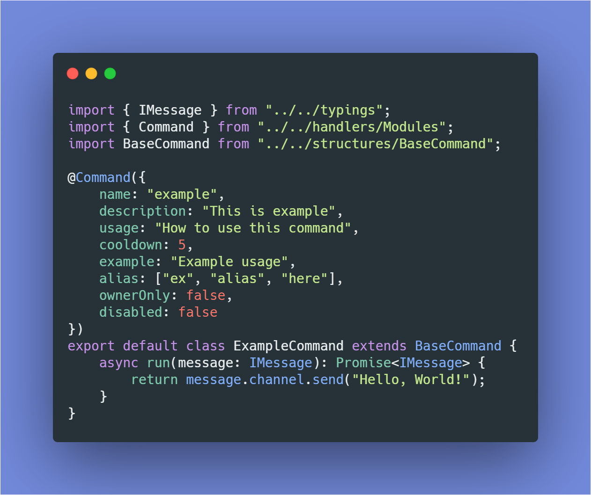

<h1 align="center">Tsumugi Kotobuki</h1>

<p align="center">
    <a href="#">
    
  </a>
  <a href='https://github.com/KurokuTetsuya/tsumugi-kotobuki/actions?query=workflow%3A%22Node.js+CI%22'></a>
  <a href='https://github.com/KurokuTetsuya/tsumugi-kotobuki/blob/master/LICENSE.md'>
    
  </a>
</p>

<p align="center">
  
</p>

<p align="center">A discord bot template using typescript decorator as command framework.</p>

# Building The Bot
### Prerequisite:
* NodeJS v12 or greater.
* Typescript v3.8.3
* For optional packages, you need to install build tools as stated [here](https://github.com/nodejs/node-gyp#installation)

### Instaling
With optional packages (recommended):
```
npm install
# or with yarn
yarn install
```
Without optional packages:
```
npm install --no-optional
# or with yarn
yarn install --ignore-optional
```

### Running
1. Rename `.env.example` to `.env` and fill out the values (example on .env.example)
2. Install all of dependencies.
3. Change all of credentials to your credentials in `src/config.json`
4. Run `npm run build` or `yarn run build` if you're using yarn
5. Start it with `npm run start:dev`!